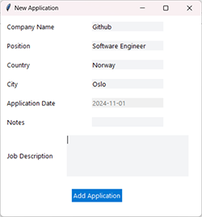

# Job Application Tracker 📊

A modern, professional desktop application for tracking job applications built with **Python** and **PyQt5**. Features a clean architecture, comprehensive logging, and a beautiful light/dark theme interface.


## ✨ Features

- **📝 Complete Job Tracking**: Track company names, positions, locations, application dates, notes, and job descriptions
- **🎯 Status Management**: Monitor application status (Applied, Rejected, Interview Invited)
- **📅 Interview Scheduling**: Track interview dates and update status
- **🎨 Modern UI**: Clean PyQt5 interface with professional styling
- **🌓 Theme Toggle**: Switch between light and dark modes with one click
- **💾 Data Persistence**: SQLite database for reliable local storage
- **📊 Comprehensive Logging**: Track all user actions and debug issues easily
- **🏗️ Clean Architecture**: SOLID principles with proper separation of concerns
- **✅ Well Tested**: 31 unit and integration tests with 95% business logic coverage

## 🖼️ Screenshots

### Light Mode


### Dark Mode


### Add New Application


## 🚀 Quick Start

### Prerequisites

- Python 3.8 or higher
- pip (Python package manager)

### Installation

1. **Clone the repository**
   ```bash
   git clone https://github.com/yourusername/Jobtracker.git
   cd Jobtracker
   ```

2. **Create a virtual environment** (recommended)
   ```bash
   python -m venv .venv
   
   # On macOS/Linux:
   source .venv/bin/activate
   
   # On Windows:
   .venv\Scripts\activate
   ```

3. **Install dependencies**
   ```bash
   pip install -r requirements.txt
   ```

4. **Run the application**
   ```bash
   python app.py
   ```

That's it! The database will be created automatically on first run.

## 📖 Usage

### Adding a Job Application
1. Click the **"Add Application"** button
2. Fill in the required fields (Company Name, Position, Country, City)
3. Optionally add notes and job description
4. Click **"Add Application"** to save

### Updating Application Status
1. Double-click any application in the table
2. Update the status dropdown
3. Optionally add interview date (format: YYYY-MM-DD)
4. Click **"Update Status"**

### Deleting Applications
1. Select one or more applications in the table
2. Click the **"Delete Selected"** button
3. Confirm the deletion

### Switching Themes
- Click the **"Toggle Theme"** button to switch between light and dark modes

## 🏗️ Architecture

The application follows **Clean Architecture** principles with strict separation of concerns:

```
src/
├── models/              # Domain entities (JobApplication, ApplicationStatus)
├── repositories/        # Data access layer (SQLite operations)
├── services/           # Business logic layer (validation, orchestration)
├── controllers/        # UI coordination layer (view ↔ service communication)
├── views/              # Presentation layer (PyQt5 UI)
└── config/             # Configuration (app settings, themes, logging)
```

**Design Principles:**
- ✅ SOLID principles throughout
- ✅ Dependency Injection
- ✅ Repository Pattern for data access
- ✅ Service Layer for business logic
- ✅ Full type hints for better IDE support

## 📊 Logging

All user actions and system events are logged for debugging and monitoring:

- **Log Location**: `logs/jobtracker_YYYYMMDD_HHMMSS.log`
- **What's Logged**: Startup, user actions, database operations, errors
- **Log Levels**: DEBUG, INFO, WARNING, ERROR, CRITICAL

Example log output:
```
2026-01-16 16:50:37 - __main__ - INFO - Job Tracker Application Starting
2026-01-16 16:50:42 - src.views.main_window - INFO - User clicked 'Add Application' button
2026-01-16 16:50:51 - src.services.job_application_service - INFO - Creating new application: TechCorp - Software Engineer
2026-01-16 16:50:51 - src.services.job_application_service - INFO - Application created successfully with ID: 1
```

See [LOGGING_GUIDE.md](LOGGING_GUIDE.md) for detailed documentation.

## 🧪 Testing

Run the comprehensive test suite:

```bash
# Run all tests
pytest tests/ -v

# Run with coverage report
pytest tests/ --cov=src --cov-report=term-missing --cov-report=html
```

**Test Coverage:**
- 31 tests (all passing)
- 95% business logic coverage
- Unit tests for models, services, repositories
- Integration tests for complete workflows

## 🛠️ Tech Stack

- **Python 3.14+** - Core language
- **PyQt5 5.15+** - Cross-platform GUI framework
- **SQLite** - Embedded database
- **pytest** - Testing framework
- **pytest-cov** - Coverage reporting

## 📁 Project Structure

```
Jobtracker/
├── app.py                      # Application entry point
├── requirements.txt            # Python dependencies
├── README.md                   # This file
├── LOGGING_GUIDE.md           # Logging documentation
├── src/                        # Source code
│   ├── models/                # Domain models
│   ├── repositories/          # Data access
│   ├── services/              # Business logic
│   ├── controllers/           # UI coordination
│   ├── views/                 # PyQt5 UI
│   └── config/                # Configuration
├── tests/                      # Test suite
│   ├── unit/                  # Unit tests
│   └── integration/           # Integration tests
├── logs/                       # Application logs (auto-created)
├── icons/                      # UI icons
├── Screenshots/                # App screenshots
└── job_applications.db         # SQLite database (auto-created)
```

## 🤝 Contributing

Contributions are welcome! Please feel free to submit a Pull Request. For major changes, please open an issue first to discuss what you would like to change.

1. Fork the repository
2. Create your feature branch (`git checkout -b feature/AmazingFeature`)
3. Commit your changes (`git commit -m 'Add some AmazingFeature'`)
4. Push to the branch (`git push origin feature/AmazingFeature`)
5. Open a Pull Request

## 📝 License

This project is licensed under the MIT License - see the LICENSE file for details.

## 🙏 Acknowledgments

- Built with [PyQt5](https://www.riverbankcomputing.com/software/pyqt/) for cross-platform GUI
- Uses [SQLite](https://www.sqlite.org/) for reliable local data storage
- Tested with [pytest](https://pytest.org/) framework
- Icons and UI design inspired by modern macOS applications

## 📧 Contact

For questions, suggestions, or issues, please open an issue on GitHub.

---

**⭐ Star this repo if you find it helpful!**


