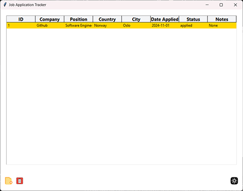

# Job Application Tracker

A job application tracker built with Python and Tkinter that helps users manage their job applications by adding, viewing, and deleting entries. This application also allows toggling between light and dark themes and uses an SQLite database to store data locally.

## Features

- **Add New Applications**: Track company names, job positions, locations, dates, and notes.
- **View Application Details**: View additional details and status updates.
- **Delete Applications**: Easily remove unwanted entries.
- **Theme Toggle**: Switch between light and dark modes.
- **Data Persistence**: Stores applications in a local SQLite database for easy access and management.

## Screenshots

## Installation

### Requirements

- Python 3.x
- Tkinter and Pillow libraries

### Steps

Follow these steps to set up and run the Job Application Tracker application locally.

### 1. Clone the Repository
Clone the repository from GitHub to your local machine.

git clone https://github.com/yourusername/job-application-tracker.git
cd job-application-tracker

